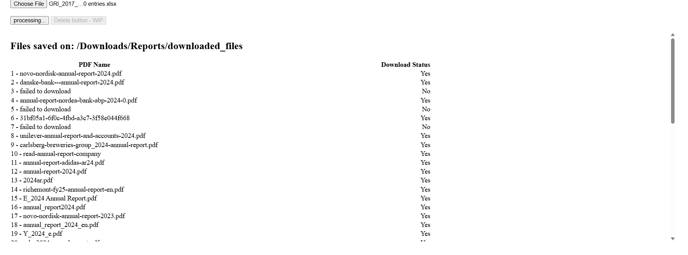

# Welcome to the PDF downloader

This app will help you download large amounts of PDF files online, and give you an overview of the downloaded files and the files that failed to download

### Prerequisite; Start the application
As of now, the app is not being hosted online and requires to be run locally.

The app consists of this backend app, and a frontend app found in [this repository](https://github.com/MeH2607/PDF-Downloader-frontend).

Both must be run and the app will be accessed on a live server for the frontend.

### Prerequisite; excel formatting
This app requires you to upload an Excel file with with a list of pdf links. The file should be formated like

|ID|URL|Alt URL|
|---|---|---|
|1|www.example.com|www.altexample.com|

**It's important to follow this format** to ensure that the app reads the file correctly

## Upload file
When you open the app, you will be greeted by this screen.

Press the "choose file" button and choose your excel file

Once uploaded, press the "upload excel file" and you will see a progress circle while it is downloading the files.

## After upload

Once finished, you will see this screen

Here you will see the list of files that has been downloaded and wether they were successfully downloaded or not

Furthormore the files will be downloaded locally on your pc in your Download folder, as presented on the app page.

A folder called *Reports* will be created with a *Download_Report* excel file with the list of downloads statuses, and a subfolder called *Files* with the downloaded files.
